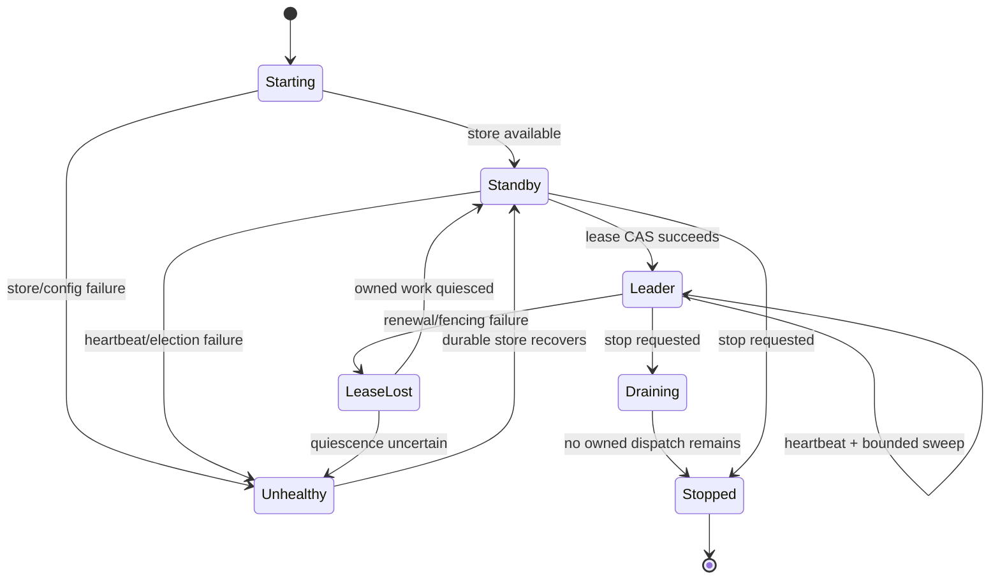
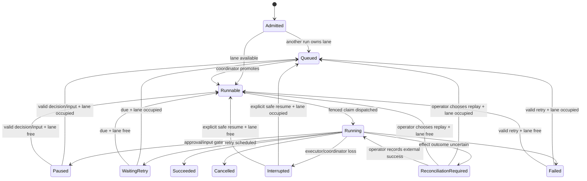
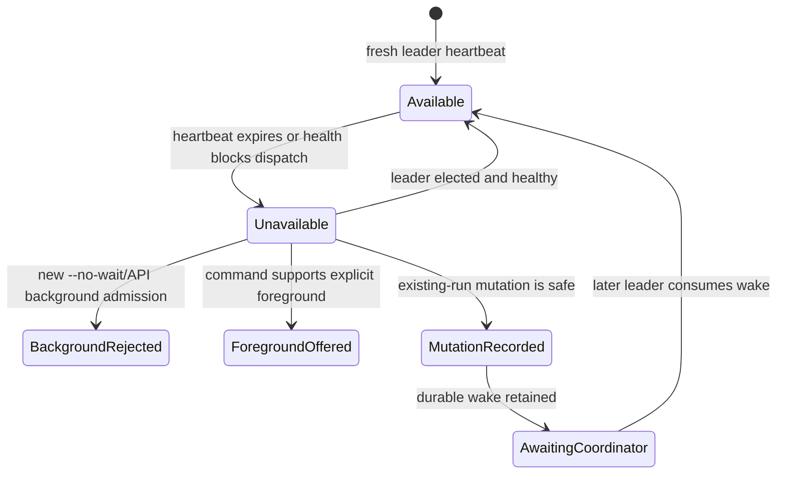
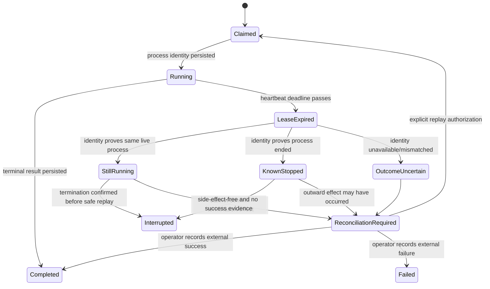
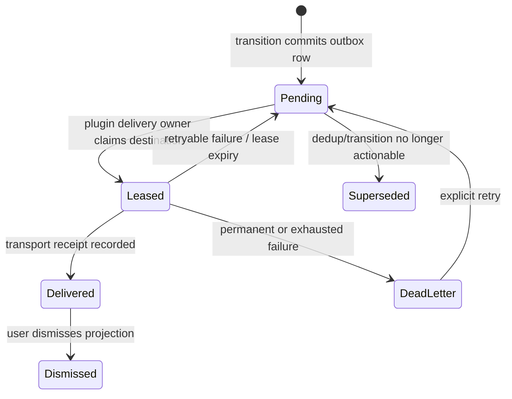
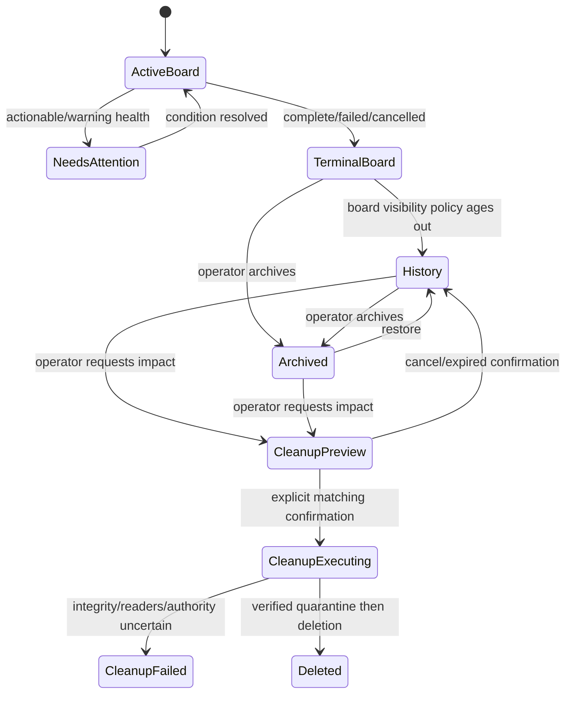

# Generic Plugin Background Services and Workflow Coordination

**Date:** 2026-07-18
**Status:** Proposed; implementation requires maintainer approval
**Scope:** Generic Hermes lifecycle hosting plus the workflow plugin's concrete coordinator consumer

## Decision summary

Hermes will add one generic, host-owned background-service lifecycle. A plugin
registers a dormant factory for selected long-lived host kinds. Hermes creates
one supervisor thread per applicable registration, calls the service's blocking
`run(stop_event)` method, records bounded health, and owns cooperative shutdown
and generation-safe reload.

The workflow plugin is the immediate consumer. It owns durable coordinator
election, heartbeat, wake records, sweeps, scheduling, recovery, evidence,
stall detection, and notification outbox behavior. Base Hermes never imports
`RunScheduler` or workflow modules and never receives workflow state.

This adds no model tool, no prompt content, no conversation mutation, and no
user-facing non-secret environment variable.

## Problem and boundaries

Foreground workflow CLI processes currently own `RunScheduler`. When they exit,
there is no durable process responsible for queued promotion, retry wake-up,
post-interaction continuation, recovery, or stall classification. Calling the
scheduler from a Desktop HTTP mutation only moves the ownership bug into a
latency-bounded request.

Hermes needs a generic lifecycle seam because Desktop/headless web and Gateway
are already long-lived plugin hosts. The seam must remain a narrow waist:

- Hermes owns registration, host selection, thread lifecycle, health wrapping,
  shutdown deadlines, and safe reload.
- plugins own all service semantics and durable state.
- service factories receive no `AIAgent`, prompts, messages, tools, provider
  credentials, model configuration, API clients, Gateway adapters, or web app.
- a hosted service is not a security sandbox; first-party code and review still
  prevent illicit global imports or closure capture.
- safe mode starts no plugin background services.
- one failed service never prevents chat, Desktop, Gateway, or sibling services
  from starting.

## Interface alternatives

### A. Host-owned blocking runner — selected

```python
class BackgroundService(Protocol):
    def run(self, stop_event: threading.Event) -> None: ...
    def health(self) -> BackgroundServiceHealth: ...
```

Hermes creates the worker thread and stop event. `run` blocks until cooperative
shutdown; an early return is an observable failure. This is the smallest API
and gives Hermes the clearest accounting boundary. It cannot forcibly kill a
Python thread, but it can retain the handle, report a timeout, and refuse a
replacement generation.

Tradeoff: a service with several internal tasks must supervise them behind one
blocking call. That is desirable for the first consumer because it forces the
workflow coordinator to own and join its complete runtime.

### B. Async `start` / `stop` / `wait` / `health`

This protocol fits asyncio-native services and lets a host monitor `wait()`.
It is viable, but wider and more error-prone: plugins create their own tasks,
`start()` can return before all work is accounted for, and adapters are needed
for the existing synchronous workflow scheduler.

Use this only if a future concrete consumer proves that the blocking contract
cannot represent its runtime. No speculative expansion is included now.

### C. Service-owned `start` / `stop` / `health`

This is convenient for thread-owning classes but gives Hermes the weakest
shutdown proof. A plugin can return from `stop()` while detached work remains,
and a timed-out `start()` can complete after the host has quarantined it. That
conflicts with the no-overlapping-generation release requirement.

### Selection rationale

Approach A is selected because lifecycle ownership and reload safety matter
more than author convenience. It exposes two service methods, has one immediate
consumer, and avoids embedding an async framework or scheduler semantics into
the generic API.

## Generic API

The public types live in a focused base module, with registration surfaced from
`PluginContext`:

```python
BackgroundServiceHostKind = Literal["web", "gateway"]
BackgroundServiceHealthState = Literal[
    "starting", "healthy", "degraded", "unhealthy"
]

@dataclass(frozen=True, slots=True)
class BackgroundServiceContext:
    host_kind: BackgroundServiceHostKind
    host_instance_id: str

@dataclass(frozen=True, slots=True)
class BackgroundServiceHealth:
    state: BackgroundServiceHealthState
    code: str
    message: str = ""
    heartbeat_at: datetime | None = None

class BackgroundService(Protocol):
    def run(self, stop_event: threading.Event) -> None:
        """Block until the host requests stop; return only after quiescence."""

    def health(self) -> BackgroundServiceHealth:
        """Return a cached, O(1), thread-safe snapshot without external I/O."""

BackgroundServiceFactory = Callable[[BackgroundServiceContext], BackgroundService]

class PluginContext:
    def register_background_service(
        self,
        name: str,
        factory: BackgroundServiceFactory,
        *,
        hosts: Collection[BackgroundServiceHostKind],
    ) -> None: ...

class PluginManager:
    def start_background_services(
        self,
        host: BackgroundServiceHostKind,
        *,
        shutdown_timeout: float = 10.0,
    ) -> BackgroundServiceHost: ...

class BackgroundServiceHost:
    def snapshot(self) -> tuple[HostedServiceSnapshot, ...]: ...
    def shutdown(self, timeout: float | None = None) -> bool: ...
```

Factories receive only immutable host kind and process-local host instance ID
and are otherwise dormant. They resolve plugin-owned profile configuration and
paths only when invoked. The framework does not pass paths, config objects,
loggers, web/Gateway objects, or model/conversation authority. The workflow
consumer uses the host identity only for durable ownership evidence. A factory
may not start a thread, acquire a durable lease, spawn a process, or open a
listener before returning its service object.

Registration identity is `<plugin-id>:<service-name>`. Names use
`[a-z0-9][a-z0-9._-]*`; host sets are non-empty; duplicate identities and
unknown host kinds fail that plugin's registration. Partial service
registrations are rolled back if the plugin's `register()` later fails.

`HostedServiceSnapshot` contains only generic lifecycle facts:

- qualified service identity, plugin, host, and generation;
- lifecycle: registered, constructing, running, stopping, stopped, failed,
  stop-timeout, or skipped-safe-mode;
- thread liveness and bounded timestamps;
- sanitized health code/message/heartbeat;
- bounded failure code/message, with tracebacks restricted to logs.

## Generic lifecycle state machine

```mermaid
stateDiagram-v2
    [*] --> Registered
    Registered --> SkippedSafeMode: safe mode
    Registered --> Constructing: host starts
    Constructing --> Running: factory returns; run entered
    Constructing --> Failed: factory/validation error
    Running --> Failed: exception or early return
    Running --> Stopping: host sets stop event
    Stopping --> Stopped: thread exits before deadline
    Stopping --> StopTimeout: deadline expires
    StopTimeout --> Stopped: old thread later exits
    Stopped --> [*]
    Failed --> [*]
    SkippedSafeMode --> [*]
```



Construction and `run()` occur inside the service supervisor thread, so a slow
factory cannot block host readiness. A failure affects only that registration.
There is no generic restart loop, dependency graph, leader election, scheduling,
or wake payload.

Health is orthogonal to lifecycle. A running workflow standby can be healthy;
durable workflow coordinator availability is not inferred from local service
health.

## Startup, shutdown, reload, and safe mode

### Host kinds and startup

- `web`: the `hermes_cli.web_server` FastAPI process, covering dashboard and
  Desktop's headless `serve` backend.
- `gateway`: `GatewayRunner` after plugin discovery and basic host readiness.
- CLI, TUI subprocesses, cron workers, and individual agent conversations are
  not service hosts.

Web binds the generic service host in FastAPI lifespan after plugin discovery
and before yielding readiness. Gateway binds after plugin discovery and its
required host resources are ready, before publishing its final running state.
Failure is recorded but does not prevent either host from becoming available.

### Shutdown

The host sets every service stop event before joining any thread, then joins
against one aggregate deadline. Plugin services stop before plugin registries
or resources they may use are torn down. A timed-out thread remains referenced,
is marked `stop_timeout`, and prevents in-process replacement. Process shutdown
may continue; daemon threads ensure a broken plugin cannot hang process exit.

### Reload

Direct `discover_and_load(force=True)` is rejected while a hosted generation is
active. Hosted reload performs:

1. mark reload in progress and reject new host binding;
2. signal all old services;
3. join concurrently against one deadline outside the manager lock;
4. if any service remains live, abort without clearing registrations or
   constructing replacements;
5. only after full quiescence, clear registries, rediscover, and start the next
   generation for the same host kinds.

One wedged plugin can therefore block a process-wide reload. This is an explicit
availability tradeoff for the stronger no-overlap guarantee. Host restart is
the recovery path.

### Safe mode

Safe mode is checked both during discovery and service-host start. No factory
is called. A reload into safe mode first stops the old generation; only after
confirmed quiescence are registrations cleared and discovery skipped.

## Workflow coordinator consumer

The workflow plugin registers one `coordinator` service for both hosts. The
factory does not capture `ctx`, `ctx.agent`, or any conversation object.

```python
ctx.register_background_service(
    "coordinator",
    create_workflow_coordinator,
    hosts={"web", "gateway"},
)
```

Every host process may construct an instance. The workflow plugin elects one
leader using its profile-local SQLite authority; generic Hermes does not elect.
Standbys continue heartbeat observation and election attempts.

### Durable ownership record

The workflow store maintains a single coordinator lease with:

- owner ID, host kind, host instance ID, PID, and process-start identity;
- monotonically increasing leadership epoch;
- acquired, heartbeat, and lease-expiry timestamps;
- coordinator schema/runtime version and health code;
- last completed sweep and last meaningful workflow progress timestamps.

Election and renewal use SQLite transactions and compare-and-swap. The epoch
fences scheduling actions and worker claims. Losing renewal stops new dispatch;
the old instance becomes standby after quiescing what it can safely own.

No POSIX-only lock is authoritative. SQLite transactions and identity checks
must work on Windows. Filesystem locks may reduce contention but cannot define
leadership.

## Coordinator ownership state machine



Only a fresh durable leader heartbeat authorizes new background admission.
Process-local `healthy` or an unexpired file lock is insufficient.

## Durable wakes and bounded sweeps

Every transition that may make work runnable commits a durable wake row or
increments a durable wake generation in the same protected mutation as the run
state/event/projection. Reasons include:

- admit, approve, reject, provide-input, resume, retry, reconcile;
- due-retry registration;
- cancellation and terminal transitions that release an execution lane;
- archive/cleanup changes that safely release queued capacity.

An in-process condition/event is only a latency optimization. Startup and
periodic bounded sweeps consume durable wakes, so a crash between commit and
local notification cannot strand work.

Each leader sweep is time- and item-bounded, cursor-based, and ordered:

1. renew leadership and verify fencing;
2. validate/repair journal and SQLite projections without deleting uncertain
   evidence;
3. inspect expired claims and executor identities;
4. apply durable cancellation/reconciliation decisions;
5. wake due retries and post-interaction continuations;
6. promote queued work fairly;
7. detect no-progress/stalled states;
8. dispatch bounded ready work and persist the next cursor.

Continuous incoming wakes cannot starve periodic recovery scans.

## Workflow continuation state machine

Execution-lane ownership is separate from lifecycle status. `paused`,
`waiting_retry`, and `interrupted` do not retain a lane. A resumed run enters
the durable runnable queue and competes fairly with already queued work.



Terminal/pause/retry/interruption transitions commit a capacity-release wake.
Duplicate wakes and promotions are idempotent. Queue ordering uses a durable
sequence, not filesystem enumeration or process arrival timing.

## Coordinator-unavailable state machine



When unavailable:

- existing state and evidence remain readable;
- new background work is rejected before run creation with
  `coordinator_unavailable`;
- callers may select an explicit supported foreground mode;
- safe existing-run mutations commit and return a warning plus durable wake;
- no API claims that continuation occurred;
- UI and CLI show heartbeat age, health reason, and valid recovery action.

If a coordinator dies after admission, the run remains durable. Health changes
to unavailable/stalled according to thresholds, and a later leader recovers it.

## Lease expiry and reconciliation state machine

Attempts record effect classification and executor identity before outward
work: owner/epoch, PID, process-start token, executor ID, start timestamp, and
log/evidence paths.



Lease expiry never deletes executor identity. Automatic replay is allowed only
when both termination and replay safety are established. Stale completions are
retained as attempt evidence even when fencing prevents them from changing the
authoritative run state.

## Stall and health classification

Thresholds are plugin configuration in `config.yaml`, with safe defaults and
schema validation. They are not new `HERMES_*` settings.

- `healthy`: fresh coordinator and meaningful progress within the applicable
  node/queue threshold.
- `waiting`: a durable approval, input, retry deadline, or queue position
  explains no execution.
- `coordinator_unavailable`: no fresh healthy leader.
- `stalled`: leader is healthy but a runnable/current run has no meaningful
  state, lease, log, or heartbeat progress beyond threshold.
- `reconciliation_required`: an outward-effect outcome is uncertain.
- `storage_degraded`: evidence/projection integrity requires repair.

Health never rewrites lifecycle state merely to simplify the UI.

## Notifications state machine

RunStore/outbox is authoritative. Workflow transitions enqueue one row per
transition/state-version/destination in the same transaction. Dismissal affects
only presentation state.



The workflow coordinator owns outbox creation, deduplication, leases, retry
policy, and durable unresolved-attention state. Destination projections are
plugin-owned:

- Gateway delivery runs only where an existing authenticated return route is
  valid and records receipts/failures in the outbox.
- Desktop reads pending/in-app notifications from the web API; Electron may
  project an OS-native notification and acknowledge the delivery receipt.
- CLI has no daemon delivery promise; status/outbox remains queryable.

Chat notifications use the existing alternation-safe outbound path or a new
message/session boundary. They never inject a synthetic user message into an
active agent loop and never mutate the cached system prompt or toolset.

Approval/input, failure, stalled, completion (configurable), cancellation, and
reconciliation-required transitions are durable. Closing the Workflows tab or
restarting a host cannot erase them.

## Archive, history, retention, and cleanup state machine

Archive is reversible visibility metadata, not a run terminal state and not a
deletion request.



Retention may change board visibility but never silently delete evidence.
Cleanup preview is the default and includes run IDs, bytes, evidence classes,
active readers/claims, index integrity, and blocked reasons. Execution requires
an explicit flag or confirmation token bound to that preview. Missing or empty
admission data never authorizes deletion.

## Evidence and authorization

Durable operator evidence includes:

- run metadata, source/actor/return-route provenance, and state versions;
- ordered events and interactions;
- node attempts, claims, coordinator epochs, process identity, and retry history;
- stdout/stderr, structured outputs, artifact metadata, content hashes, and
  storage paths;
- recovery, reconciliation, notification, archive, and cleanup decisions;
- coordinator heartbeats, health transitions, and last meaningful progress.

Raw local evidence is sensitive at rest. A single workflow-owned sanitizer is
used by evidence APIs and notification rendering. Queries are cursor-bounded,
size-bounded, and explicit about truncation. Raw artifact access requires the
strongest verified local/operator scope.

The server derives principal and scope from the mounted authentication boundary
and profile. A client header may narrow a verified scope but cannot grant one.
CLI local-admin behavior is documented as a separate trust boundary rather
than disguised as the same Desktop authorization path.

## Base/downstream change ledger

| File | Why shared change is necessary | Generic contract | Concrete consumer and boundary tests | Removal condition |
|---|---|---|---|---|
| `hermes_cli/plugin_services.py` (new) | Keep lifecycle types/supervisor out of the plugin manager god-file | blocking service protocol, host handle, snapshots, deadlines, generation/reload barrier | workflow `coordinator` registration; real-thread conformance tests | remove downstream file when upstream Hermes provides an equivalent or stronger generic service host and workflow is migrated |
| `hermes_cli/plugins.py` | Plugin registration and force reload currently have no lifecycle interlock | `PluginContext.register_background_service`, immutable attributed registry, partial-registration rollback, hosted-force-reload guard | workflow registration plus registration/safe-mode/reload tests | remove customization when upstream PluginContext/PluginManager exposes equivalent registration and no-overlap reload semantics |
| `hermes_cli/web_server.py` | Desktop/headless web is a long-lived host but currently owns only ad hoc lifecycle threads | bind/start/stop generic `web` services in FastAPI lifespan; expose sanitized process-local snapshots | workflow coordinator consumer; real `TestClient` lifespan tests | remove customization when upstream web lifespan hosts generic plugin services with the same ordering/failure policy |
| `gateway/run.py` | Gateway is a long-lived host with plugin discovery but no service lifecycle | bind/start `gateway` services after readiness; stop before plugin/resource teardown | workflow coordinator consumer; Gateway lifecycle tests with a real thread | remove customization when upstream Gateway hosts the equivalent generic lifecycle |
| `tests/hermes_cli/test_plugin_background_services.py` (new) | Prove generic contract independent of workflow | failure isolation, safe mode, health, aggregate shutdown, reload barrier | fake plugins plus a workflow registration smoke test | migrate/delete only with the upstream-equivalent test suite |
| `tests/hermes_cli/test_web_server_plugin_services.py` (new) | Prove web lifespan boundary | host filtering, startup failure isolation, stop ordering, timeout visibility | real workflow-compatible fake service | migrate/delete only with upstream-equivalent lifespan coverage |
| `tests/gateway/test_plugin_background_services.py` (new) | Prove Gateway boundary | discovery/start/stop order and chat survival | real workflow-compatible fake service | migrate/delete only with upstream-equivalent Gateway coverage |

No workflow import is permitted in any shared host file. Plugin-owned files
remain downstream customizations unless they modify an upstream-shared seam.

## Acceptance criteria

### Generic lifecycle

- two or more services start independently; factory/run failure in one does not
  block host readiness or its sibling;
- safe mode calls no service factory;
- host filtering is deterministic;
- shutdown signals all services before waiting and respects one aggregate
  deadline;
- premature return, exception, health exception, and stop timeout produce
  distinct sanitized snapshots;
- a stop timeout prevents registry clearing and replacement factory calls;
- successful reload starts generation N+1 only after every N thread exits;
- FastAPI and Gateway lifecycle tests use real threads and real host setup;
- service APIs and snapshots expose no model/conversation authority.

### Workflow coordinator

- two real host processes on one temporary profile elect exactly one leader;
- killing the leader results in takeover only after lease/fencing rules allow;
- a durable wake survives mutation-process exit and host restart;
- all approve, reject, provide-input, resume, retry, and reconcile transitions
  continue through the coordinator, never the HTTP request;
- pause/retry/interruption/terminal transitions release a lane and queued work
  is promoted without duplicate execution;
- due retry and stranded work recover without a foreground CLI process;
- background admission is rejected when no healthy leader exists; explicit
  foreground remains possible where supported;
- a mutation committed during coordinator loss remains readable and is
  consumed after recovery;
- no uncertain outward attempt is automatically replayed;
- coordinator and stall health are durable and queryable.

### Failure injection

- replace, truncate, empty, corrupt, and version-skew the admission database;
  valid evidence is preserved and destructive cleanup is blocked;
- tear the journal during append and verify recovery preserves complete frames;
- kill the coordinator before wake notification, after claim persistence,
  during an executor, after outward effect, and before terminal commit;
- hold SQLite locks through election, heartbeat, mutation, and cleanup deadlines;
- simulate PID reuse/process-start mismatch and Windows process termination
  limitations;
- drop notification delivery after lease but before receipt and verify dedup;
- force service shutdown timeout and prove no overlapping reload generation;
- close/reopen Desktop and restart Gateway while unresolved attention persists.

## Explicit non-goals

- migrating cron's existing host threads into the generic lifecycle;
- adding a permanent workflow model tool;
- using service health as workflow election authority;
- generic service auto-restart, dependencies, scheduling, or messaging;
- making third-party Python plugins a security sandbox;
- releasing or merging the candidate implementation worktree before this design
  and the amended implementation plan are approved.
