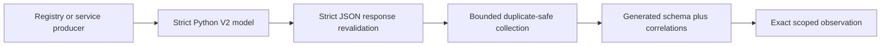

# Workflow Marketplace Strict Wire Parity Amendment

**Date:** 2026-09-05

**Status:** Approved by the user on 2026-09-05 (“approve”). The active recovery plan may now be amended and implementation may resume through its independent review gates.

**Baseline:** `bf9db2e46dd3f10dbb43e8b892a03fc4348bfef2`, branch `feat/workflow-package-marketplace`.

**Amends:** [lifecycle recovery amendment](2026-09-04-workflow-marketplace-lifecycle-recovery-amendment.md), especially sections 3, 4, 10, and 11. The [HTTP version compatibility addendum](2026-09-05-workflow-marketplace-http-version-compatibility.md) remains unchanged.

**Scope:** Hermes backend and Hermes Desktop only. No Workflow Studio change, merge, push, publication, release, history rewrite, or worktree deletion is authorized.

## 1. Decision and authority

The Python V2 public models are the sole authority for lifecycle wire acceptance. Backend producers, HTTP response validation, generated fixtures, generated TypeScript schema, Desktop decoding, and supervisor correlation must agree with those models. A producer normally emitting valid data is not a substitute for validating the public boundary.

The backend must never return HTTP 200 with a malformed lifecycle envelope. Desktop must not weaken strict decoding to accommodate malformed backend output. When the two languages disagree, correct the backend public model first, regenerate the contract artifacts, and then align Desktop.

The implementation keeps three kinds of state separate:

- Backend-owned public truth: operation, admission, capability, page, package-state, review-token metadata, and terminal outcome projections.
- Desktop-ephemeral state: a bounded server-clock observation, connection generation, active request closure, and raw confirmation token.
- Existing persisted state: admissions, transaction records, provenance, trust, and package bytes. This amendment changes none of their schemas.

### Alternatives considered

| Approach | Consequence | Decision |
| --- | --- | --- |
| Strict backend-first V2 models and generated Desktop parity | One authority; malformed registry output fails before HTTP 200; V1 remains stable | Selected |
| Relax Desktop to every shape current Python happens to accept | Preserves schema bugs, weakens fail-closed behavior, and makes generated types misleading | Rejected |
| Trust normal producers and validate only their usual outputs | Faults, stale code, or substituted registry values can still cross the public boundary | Rejected |

## 2. Evidence requiring this amendment

Task 14B’s independent review generated the corpus afresh, exercised 3,980 Python/TypeScript differential cases, and sent fault-injected results through the mounted V2 router.

- Eleven otherwise valid operations containing a U+FEFF-prefixed repository identity passed strict Python JSON validation and real GET/cancel response validation but failed Desktop validation. JavaScript `trim()` does not implement Python’s clean-text domain.
- Two inspection paths ending in a newline passed the Python runtime validator but failed the Python-emitted schema and Desktop. Normal producer sanitation hid an actual public schema mismatch.
- The existing capability, evicted-admission, operation-page, and review-token response models omit required bounds or correlations. Fault-injected admission and list routes returned malformed HTTP-200 responses.
- Request IDs derived from changes in local wall-clock time can be rejected by the backend as more than 30 seconds in the future.
- A syntactically identifier-shaped backend error code can contain a preparation token and be retained in a Desktop error object.

These are not permission to add Desktop heuristics. They identify missing or inconsistent public authority.

## 3. V2 canonical relative-path domain

V1 manifest, index, digest, package-contract, and vector artifacts remain byte-for-byte unchanged. Their existing model behavior is not silently broadened or narrowed by this amendment.

Every relative path projected inside a V2 lifecycle object uses one named `lifecycle_relative_path` domain. The backend runtime validator and generated schema metadata express the same rules:

- 1–1,024 Unicode code points and NFC-normalized;
- no Unicode `Cc` control character and no U+2028 or U+2029 line separator;
- no leading or trailing `/`, backslash, NUL, empty segment, `.` segment, or `..` segment;
- no segment beginning with an ASCII drive prefix such as `C:`;
- no segment whose Python `casefold()` value is `.git`.

This domain applies to nested inspection `package_path` and resource `path`, review package paths, installed package/workflow paths, inventory definition paths, and every other V2 field representing a package-relative path.

The generator marks this named domain explicitly rather than asking TypeScript to infer Python runtime semantics from a regular expression. Python and TypeScript validate the algorithm above against the original string; neither strips, normalizes, or rewrites a path before returning it.

A newline-bearing path is invalid at the V2 model and HTTP boundary even if an older shared V1 model accepts it. That incompatibility is deliberate fail-closed isolation and does not modify V1 artifact bytes.

## 4. Strict outer response envelopes

All outer models use the existing strict lifecycle base: immutable data, extra fields forbidden, strict scalar types, duplicate-key rejection in JSON mode, no booleans as integers, bounded collections, and canonical strings.

### Capabilities

`LifecycleCapabilities` contains exactly `schema_version`, `profile`, `registry_epoch`, `server_time`, and `capabilities`.

| Field | Rule |
| --- | --- |
| `schema_version` | Literal integer `2` |
| `profile` | Python clean text, 1–256 code points; U+FEFF is not silently trimmed |
| `registry_epoch` | Exactly 32 lowercase hexadecimal characters |
| `server_time` | Existing canonical aware UTC form ending in `Z` |
| `capabilities` | Unique subsequence of the canonical eight-value order: `operations`, `admission_replay`, `package_state`, `transactions`, `updates`, `trust`, `sources`, `inspect`; maximum eight, no unknowns |

The current release returns all eight values in that order. A future partial response may omit unsupported values without reordering the remainder; Desktop continues to capability-gate each action. Duplicate, unknown, or out-of-order values are invalid.

### Admission lookup

`AdmissionFound` continues to contain a fully strict `LifecycleOperation`.

`AdmissionEvicted` contains exactly `state`, `operation_id`, `request_id`, `registry_epoch`, `profile`, `kind`, `subject`, and `selection`:

- `state` is literal `evicted`;
- operation ID uses the existing `wmop_` domain;
- request ID is exactly 85 ASCII characters in the approved format and embeds the same `registry_epoch`;
- profile uses the same Python clean-text domain as operations;
- kind is the closed `LifecycleKind` union;
- subject type is allowed for that kind;
- selection is required for trust kinds and null for every other kind.

An evicted receipt remains token-free and contains no body, fingerprint, actor, private target, repository secret, or outcome claim.

### Operation page

`LifecycleOperationPage` contains exactly `items`, `next_cursor`, and `complete`:

- `items` has at most 100 strict lifecycle operations;
- operation IDs and request IDs are each unique within the page;
- all items share one exact profile and registry epoch;
- `next_cursor` is null or exactly 32 lowercase hexadecimal characters;
- `complete` is true exactly when `next_cursor` is null;
- an incomplete page contains at least one item.

An empty complete page is valid. Page validation does not replace the backend’s existing 1,088-record, four-snapshot, 16-MiB aggregate, actor/profile, or 30-second retention rules.

### Review-token response

`LifecycleReviewTokenResponse` contains exactly `operation_id`, `request_id`, `subject`, `selection`, `review_digest`, `confirmation_token`, and `expires_at`:

- operation ID and request ID use their exact public domains;
- subject and selection use the strict lifecycle unions;
- review digest is 64 lowercase hexadecimal characters;
- confirmation token is 32–256 ASCII characters from `[A-Za-z0-9_-]` and is excluded from representations;
- expiry is canonical UTC.

The route and Desktop helper additionally correlate these fields to the exact successful preparation, caller scope, selected workflow, and requested operation. Schema validity alone never authorizes confirmation.

## 5. Backend construction and HTTP publication

The registry constructs the strict models above, not looser look-alike containers. Before HTTP publication, capabilities, list, admission lookup, and review-token routes perform the same strict JSON revalidation already used by exact operation GET/cancel. Validation includes all nested relationships.

If construction or response revalidation fails, the route returns a fixed safe internal failure. It never returns malformed HTTP 200, skips a malformed eligible list entry, or substitutes a partial envelope. The failure contains no raw value, URL, path, token, body, fingerprint, or exception text.

The generator consumes these public models and relationship tables. Desktop-generated schema is downstream evidence, never an alternative authority.



## 6. Repository identity parity

V2 repository identity validation uses Python’s exact clean-text and credential-free Git-source domain. It preserves the original accepted string and does not call JavaScript `trim()`.

Python’s current clean-text strip set does not include U+FEFF. A U+FEFF-prefixed repository identity that passes the backend Git-source and credential checks is therefore valid V2 data and must pass Desktop unchanged. This rule does not alter the existing V1 source sanitizer, Task 13 diagnostics, or source request behavior.

The generator emits the Python clean-text/casefold facts required by Desktop. Handwritten TypeScript must not substitute JavaScript whitespace or lowercase semantics.

## 7. Request-ID clock observation

Desktop never derives an admission timestamp from a later local wall-clock reading. After an exactly correlated capabilities response, it captures an ephemeral observation:

```typescript
interface LifecycleClockObservation {
  registry_epoch: Epoch32
  server_time_ms: number
  wall_received_ms: number
  monotonic_received_ms: number
}
```

To mint a request ID, Desktop samples both clocks again and computes:

```text
monotonic_elapsed = monotonic_now - monotonic_received
wall_elapsed = wall_now - wall_received
```

Minting is refused and capabilities must be probed again when either elapsed value is negative or greater than 300,000 ms, when either value is non-finite, or when their absolute difference exceeds 1,000 ms. The wall clock is used only to detect adjustment/sleep discontinuity; it is never added to the backend timestamp.

Otherwise:

```text
issued_ms13 = floor(server_time_ms + monotonic_elapsed)
request_id = wmreq_<observed epoch32>_<issued_ms13>_<cryptographic random32>
```

The observation is bound to the exact connection generation, profile, authenticated principal, and registry epoch. It is discarded on disconnect, scope/principal/epoch change, failed freshness checks, or application restart. It is never persisted or placed in URLs, query keys, analytics, or operation history.

Failure to establish a fresh observation produces the fixed local code `marketplace_clock_revalidation_required`; callers reprobe capabilities rather than guessing a timestamp. Backend five-minute-old and 30-second-future admission checks remain authoritative.

```mermaid
sequenceDiagram
  participant D as Desktop
  participant B as Backend
  D->>B: GET lifecycle/v2/capabilities
  B-->>D: epoch plus canonical server_time
  Note over D: capture wall and monotonic receipt clocks
  D->>D: validate elapsed clocks and freshness
  alt clocks remain coherent
    D->>B: POST with server_time plus monotonic elapsed request ID
  else adjustment, sleep gap, stale observation, or scope change
    D->>B: reprobe capabilities; no operation POST
  end
```

## 8. Secret-safe HTTP errors

An HTTP response body is untrusted even when it comes from the backend. Desktop never copies an arbitrary identifier-shaped `detail.code` into an error object.

The backend defines and the generator emits a closed `LifecycleHttpErrorCode` set for codes that drive V2 transport/reconciliation behavior:

- `marketplace_admission_capacity`
- `marketplace_admission_not_found`
- `marketplace_epoch_changed`
- `marketplace_internal_error`
- `marketplace_list_capacity`
- `marketplace_list_expired`
- `marketplace_operation_capacity`
- `marketplace_operation_conflict`
- `marketplace_operation_not_found`
- `marketplace_operation_unavailable`
- `marketplace_request_conflict`
- `marketplace_request_expired`
- `marketplace_request_invalid`
- `marketplace_review_unavailable`

Desktop-local codes are closed separately: `marketplace_lifecycle_unsupported`, `marketplace_network_error`, `marketplace_invalid_response`, `marketplace_request_failed`, and `marketplace_clock_revalidation_required`.

Only an exact member of the generated backend set may be retained. Unknown, malformed, or token-shaped values map to `marketplace_request_failed`; numeric HTTP status remains a separate bounded number. Error messages are fixed. Raw bodies, response snippets, URLs, nested values, thrown causes, and unrecognized codes do not enter the error object, logs, stores, query data, DOM, or persistence.

Terminal `LifecyclePublicError` inside a strictly validated operation is a different backend-owned projection. Its fixed message/code is produced by the operation boundary and never copied from request content or a confirmation token.

## 9. Generated artifacts and differential authority

The fixture generator emits:

- the complete token-free public corpus;
- TypeScript wire types and structural schema;
- kind/result/subject/phase tables;
- named domain descriptors for Python clean text, casefold, repository identity, and lifecycle-relative paths;
- the closed transport error-code set.

Generation is deterministic from real temporary Git/service/registry scenarios. Checked bytes contain no temporary paths, machine-specific URLs, credentials, bearer values, confirmation tokens, user homes, or nondeterministic clock/random values. `--check` regenerates from scratch and compares exact bytes.

The TypeScript decoder returns fresh plain objects and applies generated domain descriptors plus handwritten cross-field relationships. Handwritten rules must not duplicate generated nested field inventories.

## 10. Compatibility and migration

- No V1 route, V1 operation shape, package manifest/index/digest format, persisted admission/transaction/provenance/trust schema, or package-contract-v1 artifact changes.
- No new backend URL. Existing lifecycle-v2 routes become stricter at response construction/publication.
- Correct existing V2 responses remain compatible. Data violating the new path or outer-envelope rules fails closed instead of becoming HTTP 200.
- Existing `bf9db2e46d` generated Desktop work remains visible in history and is corrected through later commits; it is not reverted or rewritten.
- The current Electron original-byte duplicate/size boundary stays in place. This amendment changes neither its IPC response union nor its lifecycle-only routing.
- Workflow Studio remains untouched. A future Studio pin continues to use the unchanged package-contract-v1 artifact hashes.

## 11. Required test matrix

| Boundary | Backend/Python proof | Desktop/transport proof |
| --- | --- | --- |
| V2 paths | Strict JSON accepts ordinary Unicode/U+FEFF where applicable; rejects every `Cc`, U+2028/U+2029, newline, traversal, drive, slash, backslash, non-NFC, and `.git` casefold variant | Generated schema agrees for every mutated fixture; no rewriting |
| Capabilities | Duplicate/unknown/out-of-order values, invalid profile/epoch/time, extras, and wrong scalar types rejected before response | Exact profile/time/epoch; action gating accepts supported subsequences only |
| Evicted admission | ID/epoch/kind/subject/selection faults rejected; actual fault-injected route cannot emit malformed HTTP 200 | Exact request/scope/correlation; evicted never clears current-state barrier by itself |
| Operation page | 0/1/100/101 items, duplicate ID/request, mixed profile/epoch, cursor pattern, complete/cursor relation, incomplete-empty | Same acceptance; multi-page consumer additionally detects cross-page duplicates in 14C1 |
| Review token | ID/request/subject/selection/digest/token length+alphabet/expiry strict; raw token absent from repr/errors/history | Exact expected preparation correlation; token only in ephemeral returned value |
| Repository identity | Python-valid U+FEFF/file/HTTP/HTTPS/shorthand positives plus credential/invalid negatives survive real GET/cancel response validation | Byte-exact agreement without V1 sanitizer changes |
| Clock observation | Actual admission accepts stable IDs and rejects old/future IDs | Stable clocks mint; +31-second wall adjustment, backwards clock, sleep discrepancy, >300-second observation, scope/epoch change refuse before POST; cryptographic random only |
| Error secrecy | Every listed code has an intentional route status; unknown service values become a safe envelope | Listed codes retained; token-shaped/unknown/nested/oversized bodies map generic and serialize without secret |
| Generation | Fresh real Git/service run equals checked bytes and validates all Python cases | Every generated valid/invalid case agrees; isolated rule mutation changes output |
| Compatibility | V1 HTTP suites and byte hashes unchanged; V2 exact GET/cancel remain strict | V1 get/cancel/browse/source controls unchanged; collector legacy/look-alike controls pass |

Tests assert actual HTTP status/body and user-observable safe behavior, not source text, helper call counts, snapshots, or self-derived expectations. Python tests run only through the repository wrapper with retries disabled. Independent reviewers author their own bounded differential and real-route probes.

## 12. Implementation sequencing and acceptance

After written approval, update the active recovery plan before production edits and split the correction into two independently reviewed units:

1. Backend strict-wire correction: V2 path domain, capabilities/admission/page/token models, strict route publication, generator authority inputs, Python differential and fault-injected real-route tests.
2. Desktop parity correction: regenerate fixtures/types/schema; implement exact U+FEFF repository behavior, monotonic clock observation, closed safe errors, and all Python/TypeScript/transport differential regressions.

Run one implementation agent at a time. Each unit starts with observed failing behavior tests, ends in a new commit, and receives a fresh executable reviewer. The second unit cannot weaken Desktop to pass malformed backend values. Task 14B is accepted only when both units and the original five Important findings are independently clean.

Then resume 14C1, 14C2, 14D, 14E, 14F, Task 15, whole-branch review, and user handoff in the already-approved order. No merge occurs without explicit user approval.
